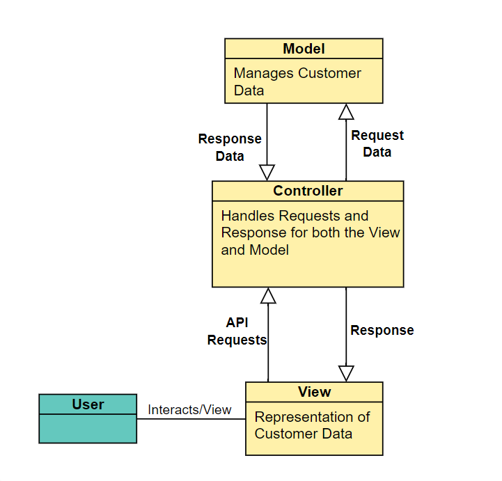

# InterviewCodingTask

## **To-do list**
- [ ] Set up Dockerfiles to create docker images for each "*end*"
  - [ ] Frontend
  - [ ] Backend
  - [x] DB-end :) 
- [ ] API Server
  - [ ] Set up UnitTests and Success conditions
  - [ ] Request mapping 
  - [ ] Database data mapping
  - [ ] Database Connection
  - [ ] Database Query functions
    - [ ] Search -> Get Request
    - [ ] Add -> Post Request
    - [ ] Edit -> Put/Post Request
- [x] Database MySQL
  - [x] Create table based on AchmeBroker.txt file
- [ ] Frontend VUE
  - [ ] Json response from a get request to Server API 
  - [ ] Transform Json to User-friendly output - Table
  - [ ] Prettify - Finalise CSS and make the site appealing

Insert class diagram or workflow 

## **My Approach Notes**

Stack of choice: 
- Frontend: Vue
- Backend: C# Asp.net Webapi
- Database: MySQL
- Docker

I will be utilising the Model-View-Controller Architectural pattern as this will seperate the logic into 3 interconnected parts. 

***Why use docker?*** It isolates the environment during development, testing, and deployment. It is an overall Quality of development life improvement :)

It also aides development by isoloating the different endpoints locally.

Development progress will be reflected in the To-Do List above!

## **Digest of task**
Client would like to interact with his customers data(policies) over the internet.

The basic functions that the client would like to include are(CRUD):
1. Add
2. Search
3. Edit 

The data will be stored in a DB while read/write queries will be handled via an API. 

The Frontend should mirror a policy list webpage - and the overall appeal and design of the webpage must look GOOD! :)

## **Extras**

To-do once base requirements are fulfilled